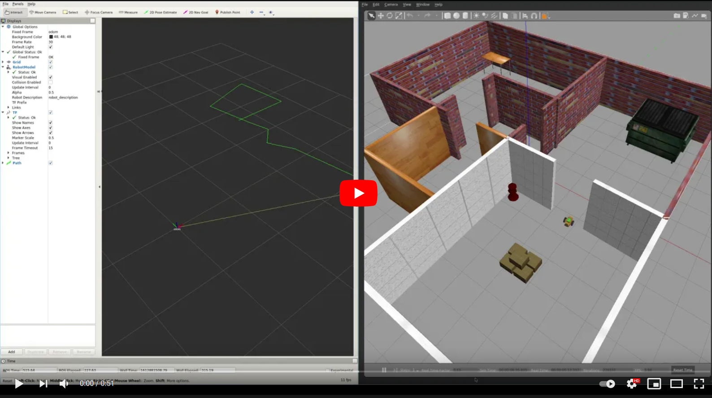
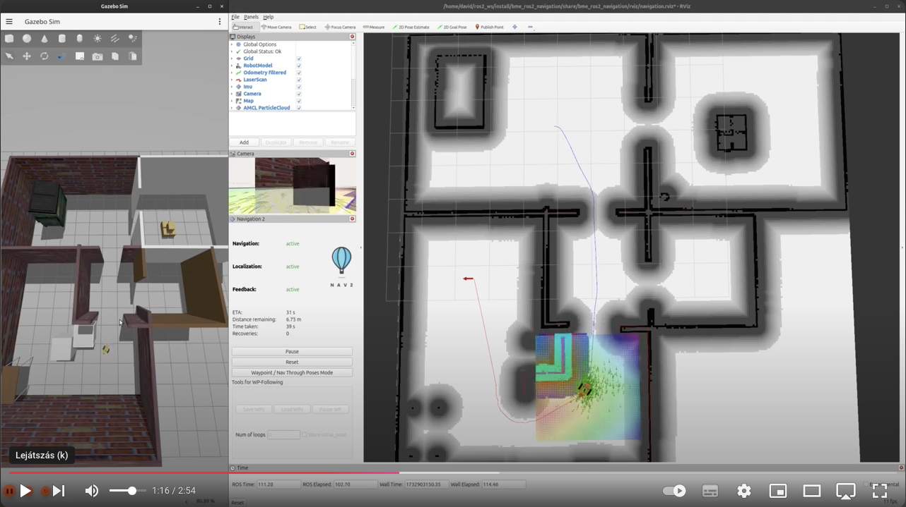
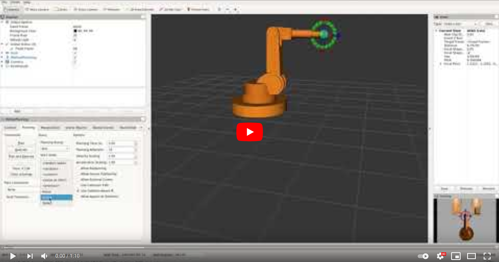
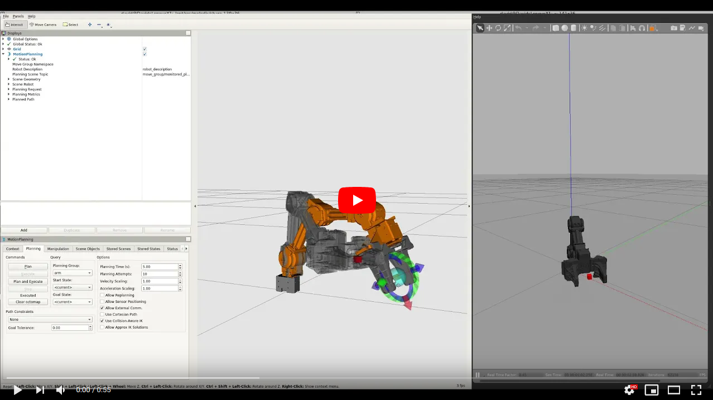
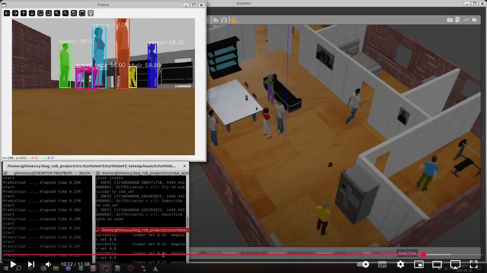

[//]: # (Image References)

[image1]: ./assets/markdown.svg "Markdwonn"
[image2]: ./assets/terminator.png "Terminator"
[image3]: ./assets/vcxsrv_1.png "VcXsrv"
[image4]: ./assets/vcxsrv_2.png "VcXsrv"
[image5]: ./assets/vcxsrv_3.png "VcXsrv"

# Week 1-2: Introduction to ROS(2)

## This is how far we will get by the end of the semester: 

### In the first half of the course we'll learn how to simulate mobile robots, sensors, actuators. How to do mapping localization and navigation.

  <a href="https://www.youtube.com/watch?v=YRHxixKr6r4"></a>  
  <a href="https://www.youtube.com/watch?v=L2L7snV4sCs"></a>  

### In the second half of the course we'll learn about the simulation of robotic arms with direct and inverse kinematics.

  <a href="https://www.youtube.com/watch?v=AK4aVfQVkVA"></a>  
  <a href="https://www.youtube.com/watch?v=mm2vKYH-Jy8"></a>  

### Here you see a short video about the final projects from the previous years:

<a href="https://www.youtube.com/watch?v=uLRQJh-y9AU"></a>

## Requirements for completing the course:

Detailed description and requirements of the final project can be found on this [link](https://docs.google.com/spreadsheets/d/1gMaBODfGlU8p0b80DhkFaF4C9gJfaIIUKGdBXtmJcQI/edit?usp=sharing). 

### Short summary:
Registration deadline for projects: **week 5**  
Submission deadline: **week 14**
   - Project teams should consist of 3, maximum 4 members.
   - The project submission will take place live (on Teams) in 15+5 minutes
   - The project documentation should be in Markdown format on GitHub (no PPT required!)

### Available real robots at the department:

PICS

# Table of Contents
1. [What is ROS(2)?](#What-is-ROS(2)?)
2. [Required softwares](#Required-softwares)
3. [Basics of ROS2](#Basics-of-ROS2)  
3.1. [ROS Master](#ROS-Master)  
3.2. [ROS Node](#ROS-Node)  
3.3. [Publisher](#Publisher)  
3.4. [Subscriber](#Subscriber)  
3.5. [rqt](#rqt)  
3.5. [Launchfile](#Launchfile)  
3.5. [Services](#Services)  
3.5. [Messages](#Messages)  
4. [Turtlesim](#Turtlesim)
5. [Saját Turtlesim node](#Saját-Turtlesim-node)

# What is ROS(2)?
ROS, or Robot Operating System, is an open-source framework designed to facilitate the development of robotic applications. It provides a collection of tools, libraries, and conventions that simplify the process of designing complex robot behaviors across a wide variety of robotic platforms.

ROS was initially developed in 2007 by the Stanford Artificial Intelligence Laboratory and continued by Willow Garage, with the goal of providing a common platform for research and development in robotics. The primary motivation was to create a standard framework that could support a broad range of robotic applications, promote code reuse, and foster collaboration within the robotics community.

Key reasons for ROS development include:

- **Standardization**: Creating a common platform that simplifies the integration of different hardware and software components.
- **Modularity**: Enabling the development of modular and reusable software components (nodes) that can be easily shared and adapted for various robotic systems.
- **Community Collaboration**: Encouraging collaboration among researchers and developers, resulting in a vast collection of tools and libraries.

### Transition to ROS 2

ROS 2 was developed to address the limitations of ROS 1 and meet the growing demands for industrial and commercial robotics applications. The development began around 2014 and aimed to enhance the capabilities of ROS, particularly in areas such as security, real-time performance, and support for multi-robot systems. In practice, the biggest difference is in the underlying middleware, ROS1 uses a custom transport layer and message-passing system that was not designed for real-time or distributed applications (see ROS1's [`roscore`](http://wiki.ros.org/roscore)).

The latest ROS1 release is ROS Noetic which was intended to be used on Ubuntu 20.04.

# Required softwares

<details>
<summary>Ubuntu 24.04 LTS</summary>

<br>In the course we'll use ROS2 [Jazzy Jalisco](https://docs.ros.org/en/jazzy/index.html), which requires Ubuntu 24.04 for the smoothest operation.

You have a couple of options, but the most recommended is the native install of the operating system.

1) Native install
2) Windows 11 WSL2 (Windows Subsystem Linux): [instructions](https://documentation.ubuntu.com/wsl/en/latest/guides/install-ubuntu-wsl2/)
3) Virtual machine, recommended: VMware fusion is [now free for personal use](https://blogs.vmware.com/teamfusion/2024/05/fusion-pro-now-available-free-for-personal-use.html)
4) Docker container
5) Using an online environment e.g. [The Construct](https://www.theconstruct.ai)

The options 1. and 2. are the most preferred solutions, in an exotic case like mine, if you want to install Ubuntu 24.04 in virtual machine on Apple silicon [this](https://www.youtube.com/watch?v=kDosGTdwqO0) is a very good tutorial.

</details>

<details>
<summary>Visual Studio Code</summary>

<br>The recommended code editor during the course is [Visual Studio Code](https://code.visualstudio.com/docs/setup/setup-overview), but it's up to your choice if you want to go with your different editor. Depending on your Ubuntu install method you might install it natively on Ubuntu, in your virtual environment or on your host operating system.

Recommended extensions to install:
- Markdown All in One
- C/C++
- Python
- CMake Tools
- Remote - SSH - if you work on physical robots, too
- Remote - WSL - if you do the course using WSL2
</details>

<details>
<summary>GitHub and a git client</summary>

<br>The course materials are available on GitHub, and the submissions of your final projects shall also use GitHub. *You'll need a very good excuse why to use alternative git solutions like GitLab.*

So I encourage everyone to [register your GitHub accounts](https://github.com/home), and if you are there don't forget to [sign up for the GitHub Student Developer Pack](https://education.github.com/pack) which gives you a bunch of powerful developer tools for free.

I recommend to use a graphical git client that can boost your experience with git, in my optinion the best one is [GitKraken](https://www.gitkraken.com), which is not a free software, but you get the pro version as part of the GitHub Student Developr Pack! If you prefer using git as a *cli* tool then no worries, it's absoluetely all right.

</details>

<details>
<summary>Markdown</summary>

<br>Markdown is a lightweight, plain-text formatting language used to create formatted documents. It was created by John Gruber in 2004 with the goal of being easy to read and write, using simple syntax to style text, create lists, links, images, and more. It is widely used for writing documentation, readme files, and content for static websites.

Basic Markdown Syntax

- Headings: `#` Heading 1, `##` Heading 2, etc.
- Bold: `**bold text**` or `__bold text__`
- Italic: `*italic text*` or `_italic text_`
- Lists:
    - Unordered: `- Item` or `* Item`
	- Ordered: `1. Item`
	- Links: `[Link text](URL)`
	- Images: ``
	- Code: Inline code or code blocks using triple backticks (```)

GitHub Flavored Markdown (GFM)

GitHub Flavored Markdown (GFM) is a variant of Markdown used by GitHub to provide additional features and syntax that are not available in standard Markdown. It includes:

- Tables:
    ```
    | Column 1 | Column 2 |
    |----------|----------|
    | Row 1    | Data     |
    | Row 2    | Data     |
    ```
- Task lists:
    ```
    - [x] Task 1
    - [ ] Task 2
    ```
- Strikethrough: `~~strikethrough text~~`
- Syntax highlighting in a specific language:
    ```
    ```python
    def hello_world():
    print("Hello, world!")
    ```
- Tables of Contents
- @mentions for users, references to issues, and pull requests using #number

Most of the tips and tricks that you might need for your own project documentation can be found in the source of this readme that you read right now, feel free to use any snippets from it!

</details>

<details>
<summary>A good terminal</summary>

  - Letöltés:  
    - Windows:  
      https://code.visualstudio.com/
    - Linux:  
      Snap store-ból: `sudo snap install --classic code`
  - Javasolt extension-ök:
    - Markdown All in One
    - C/C++
    - Python
    - CMake Tools
    - ROS
    - Remote - SSH
    - Remote - WSL
</details>

<details>
<summary>And finally, ROS2 Jazzy</summary>

  - Letöltés:  
    - Windows:  
      https://code.visualstudio.com/
    - Linux:  
      Snap store-ból: `sudo snap install --classic code`
  - Javasolt extension-ök:
    - Markdown All in One
    - C/C++
    - Python
    - CMake Tools
    - ROS
    - Remote - SSH
    - Remote - WSL
</details>


VMware shared folder mount:
/usr/bin/vmhgfs-fuse .host:/BME/ROS2-lessons /home/david/ros2_ws/src/ROS2-lessons -o subtype=vmhgfs-fuse,allow_other
(https://www.liquidweb.com/blog/create-vmware-shared-folder/)

Install ROS:
https://docs.ros.org/en/jazzy/Installation/Ubuntu-Install-Debs.html

Setup .bashrc:
source /opt/ros/jazzy/setup.bash
https://docs.ros.org/en/jazzy/Tutorials/Beginner-CLI-Tools/Configuring-ROS2-Environment.html

Run samples:
https://docs.ros.org/en/jazzy/Installation/Ubuntu-Install-Debs.html#try-some-examples
ros2 run demo_nodes_cpp talker
ros2 run demo_nodes_py listener

# Basics of ROS2

turtlesim:
sudo apt install ros-jazzy-turtlesim

ros2 run turtlesim turtlesim_node

ros2 run turtlesim turtle_teleop_key

RQT, rqt_graph

Create colcon workspace
mkdir -p ~/ros2_ws/src
cd ~/ros2_ws

Create our first python package:
ros2 pkg create --build-type ament_python bme_ros2_tutorials_py

Create hello world
```python
#!/usr/bin/env python3

# Main entry point, args is a parameter that is used to pass arguments to the main function
def main(args=None):
    print("Hello, world!")

# Check if the script is being run directly
if __name__ == '__main__':
    main()
```

Edit setup.py

1: packages


```python
    #packages=find_packages(exclude=['test']),
    packages=[package_name, 'scripts'],
```


2: entry point

```python
    entry_points={
        'console_scripts': [
            'py_hello_world = scripts.hello_world:main'
        ],
    },
```

build:
`colcon build`

source: source install/setup.bash
this we add to .bashrc:
source ~/ros2_ws/install/setup.bash

run it:
ros2 run bme_ros2_tutorials_py py_hello_world


Upgrade hello world to ROS hello world

```python
#!/usr/bin/env python3
import rclpy # Import ROS2 python interface

# Main entry point, args is a parameter that is used to pass arguments to the main function
def main(args=None):
    rclpy.init(args=args)                          # Initialize the ROS2 python interface
    node = rclpy.create_node('python_hello_world') # Node constructor, give it a name
    node.get_logger().info("Hello, ROS2!")          # Use the ROS2 node's built in logger
    node.destroy_node()                            # Node destructor
    rclpy.shutdown()                               # Shut the ROS2 python interface down

# Check if the script is being run directly
if __name__ == '__main__':
    main()
```

ros2 run bme_ros2_tutorials_py py_hello_world

Create our python publisher
```python
#!/usr/bin/env python3
import rclpy
from std_msgs.msg import String # Import 'String' from ROS2 standard messages
import time

def main(args=None):
    rclpy.init(args=args)
    node = rclpy.create_node('python_publisher')
    # Register the node as publisher
    # It will publish 'String' type to the topic named 'topic' (with a queue size of 10)
    publisher = node.create_publisher(String, 'topic', 10)

    msg = String()                     # Initialize msg as a 'String' instance
    i = 0
    while rclpy.ok():                  # Breaks the loop on ctrl+c
        msg.data = f'Hello, world: {i}' # Write the actual string into msg's data field
        i += 1
        node.get_logger().info(f'Publishing: "{msg.data}"')
        publisher.publish(msg)         # Let the node publish the msg according to the publisher setup
        time.sleep(0.5)                # Python wait function in seconds

    node.destroy_node()
    rclpy.shutdown()

if __name__ == '__main__':
    main()
```

Edit setup.py

run it:
ros2 run bme_ros2_tutorials_py py_publisher


let's see it with echo and rqt

ros2 topic echo /topic

rqt_image

Let's make it more OOP in a new file:
```python
#!/usr/bin/env python3
import rclpy
from rclpy.node import Node     # Import ROS2 Node as parent for our own node class
from std_msgs.msg import String

class MyPublisherNode(Node):
    def __init__(self):
        super().__init__("python_publisher_oop")
        self.publisher_ = self.create_publisher(String, 'topic', 10)
        self.timer = self.create_timer(0.5, self.timer_callback)     # Timer callback, period in seconds, not frequency!
        self.i = 0
        self.msg = String()
        self.get_logger().info("Publisher OOP has been started.")

    def timer_callback(self):                                        # Timer callback function implementation
        self.msg.data = f"Hello, world: {self.i}"
        self.i += 1
        self.get_logger().info(f'Publishing: "{self.msg.data}"')
        self.publisher_.publish(self.msg)

def main(args=None):
    rclpy.init(args=args)
    node = MyPublisherNode() # node is now a custom class based on ROS2 Node
    rclpy.spin(node)         # Keeps the node running until it's closed with ctrl+c
    node.destroy_node()
    rclpy.shutdown()

if __name__ == "__main__":
    main()
```

Edit setup.py, run it:
ros2 run bme_ros2_tutorials_py py_publisher_oop


Let's make it in cpp, create a new package, it's less convinient in ROS2 to mix C++ and Python nodes within a package...
it's possible though, see example:
...

Create new package:
ros2 pkg create --build-type ament_cmake bme_ros2_tutorials_cpp

Cpp publisher here

```cpp
#include "rclcpp/rclcpp.hpp"
#include "std_msgs/msg/string.hpp"

class MyPublisherNode : public rclcpp::Node
{
public:
    MyPublisherNode() : Node("cpp_publisher"), count_(0)
    {
        publisher_ = this->create_publisher<std_msgs::msg::String>("topic", 10);
        timer_     = this->create_wall_timer(std::chrono::milliseconds(500),
                                                std::bind(&MyPublisherNode::publishString, this));
        RCLCPP_INFO(this->get_logger(), "CPP publisher has been started.");
    }

private:
    void publishString()
    {
        auto msg = std_msgs::msg::String();
        msg.data = "Hello, world: " + std::to_string(this->count_++);
        RCLCPP_INFO(this->get_logger(), "Publishing: '%s'", msg.data.c_str());
        publisher_->publish(msg);
    }

    size_t count_;
    rclcpp::Publisher<std_msgs::msg::String>::SharedPtr publisher_;
    rclcpp::TimerBase::SharedPtr timer_;
};

int main(int argc, char **argv)
{
    rclcpp::init(argc, argv);
    rclcpp::spin(std::make_shared<MyPublisherNode>());
    rclcpp::shutdown();
    return 0;
}
```

Edit the CMakeLists.txt:
```bash
find_package(rclcpp REQUIRED)
find_package(std_msgs REQUIRED)

add_executable(publisher_cpp src/publisher.cpp)
ament_target_dependencies(publisher_cpp rclcpp std_msgs)

install(TARGETS
  publisher_cpp
  DESTINATION lib/${PROJECT_NAME})
```
build, run:
ros2 run bme_ros2_tutorials_cpp publisher_cpp


echo, rqt

create python subscriber
```python
#!/usr/bin/env python3
import rclpy
from std_msgs.msg import String


def main(args=None):
    rclpy.init(args=args)
    node = rclpy.create_node('python_subscriber')

    def subscriber_callback(msg):                      # Subscriber callback will be invoked every time when a message arrives to the topic it has subsctibed
        node.get_logger().info(f"I heard: {msg.data}")

    # Register the node as a subscriber on a certain topic: 'topic' (with a certain data type: String)
    # and assign the callback function that will be invoked when a message arrives to the topic
    # with a queue size of 10 which determines how many incoming messages can be held in the subscriber’s
    # queue while waiting to be processed by the callback function
    subscriber = node.create_subscription(String, 'topic', subscriber_callback, 10) 

    rclpy.spin(node)

    node.destroy_node()
    rclpy.shutdown()


if __name__ == '__main__':
    main()
```

Add node to setup.py
build
run:


create oop subscriber based on our previous template
```python
#!/usr/bin/env python3
import rclpy
from rclpy.node import Node
from std_msgs.msg import String

class MySubscriberNode(Node):
    def __init__(self):
        super().__init__("python_subsciber_oop")
        self.subscriber_ = self.create_subscription(String, 'topic', self.subscriber_callback, 10)
        self.get_logger().info("Subsciber OOP has been started.")

    def subscriber_callback(self, msg):
        self.get_logger().info(f"I heard: {msg.data}")

def main(args=None):
    rclpy.init(args=args)
    node = MySubscriberNode()
    rclpy.spin(node)
    node.destroy_node()
    rclpy.shutdown()

if __name__ == "__main__":
    main()
```

rqt, rqt_graph, language agnostic pub-sub
PIC!

create cpp subscriber
```cpp
#include "rclcpp/rclcpp.hpp"
#include "std_msgs/msg/string.hpp"

class MySubscriberNode : public rclcpp::Node
{
public:
    MySubscriberNode() : Node("cpp_subscriber")
    {
        subscriber_ = this->create_subscription<std_msgs::msg::String>(
            "topic", 10, std::bind(&MySubscriberNode::subscriber_callback, this, std::placeholders::_1));
    }

private:
    void subscriber_callback(const std_msgs::msg::String & msg) const
    {
        RCLCPP_INFO(this->get_logger(), "I heard: '%s'", msg.data.c_str());
    }

    rclcpp::Subscription<std_msgs::msg::String>::SharedPtr subscriber_;
};

int main(int argc, char **argv)
{
    rclcpp::init(argc, argv);
    auto node = std::make_shared<MySubscriberNode>();
    rclcpp::spin(node);
    rclcpp::shutdown();
    return 0;
}
```

create launchfiles in a launch package withou specifying any build type (it sets it up as cmake package)
ros2 pkg create bme_ros2_tutorials_bringup

Create a launch folder
mkdir launch

We can freely delete include and src folders:
rm -rf include/ src/

Add to CMakeLists.txt:
```bash
install(DIRECTORY
  launch
  DESTINATION share/${PROJECT_NAME}
)
```


Create a new launch file, publisher_subscriber.py
touch publisher_subscriber.py

create launch file, first only with the publisher:
```python
from launch import LaunchDescription
from launch_ros.actions import Node

def generate_launch_description():
    ld = LaunchDescription()

    publisher_node = Node(
        package="bme_ros2_tutorials_py",
        executable="py_publisher",
        name="my_publisher"
    )

    ld.add_action(publisher_node)
    return ld
```

Build the workspace:
colcon build

Source the worspace:
source ~/ros2_ws/install/setup.bash

Execute the launchfile:
ros2 launch bme_ros2_tutorials_bringup publisher_subscriber.py

We can notice that our node is now called `my_publisher` instead of `python_publisher` as earlier (and as we hardcoded in the publisher's python code). With launch files we can easily rename our nodes for better handling as our application scales up.

We can use the ros2 node list tool to list our nodes and the output should look like this:
```bash
david@david-ubuntu24:~/ros2_ws$ ros2 node list 
/my_publisher
```

Let's add the subscriber too:

```python
from launch import LaunchDescription
from launch_ros.actions import Node

def generate_launch_description():
    ld = LaunchDescription()

    publisher_node = Node(
        package="bme_ros2_tutorials_py",
        executable="py_publisher",
        name="my_publisher",
    )

    subscriber_node = Node(
        package="bme_ros2_tutorials_py",
        executable="py_subscriber",
        name="my_subscriber",
    )

    ld.add_action(publisher_node)
    ld.add_action(subscriber_node)
    return ld
```

rebuild, and run
ros2 launch bme_ros2_tutorials_bringup publisher_subscriber.py

both nodes are started, we can visually see using rqt_graph or the cli tool:
```bash
david@david-ubuntu24:~/ros2_ws$ ros2 node list 
/my_publisher
/my_subscriber
```

There is another useful cli tool which list the topics:
```bash
david@david-ubuntu24:~/ros2_ws$ ros2 topic list 
/parameter_events
/rosout
/topic
```

With launch files we can not just rename our nodes, but we can also re-map topics, let's try to remap the existing `topic` to `another_topic`:

Add remapping to the publisher:
```python
        remappings=[
            ("topic", "another_topic")
        ]
```

Build and run

with ros2 topic list:
david@david-ubuntu24:~/ros2_ws$ ros2 topic list 
/another_topic
/parameter_events
/rosout
/topic

Now the subsriber is not triggered because it's still listening to the topic while the publisher sends its messages to another_topic, we can see it visually that our two nodes are unconnected with rqt_grap:


We can also use the node info cli tool to check what are the published topics and the subscriptions for a specific node:
ros2 node info /my_publisher

Let's remap our subscriber too!

Don't forget to rebuild!

Now let's add more publishers and subscribers, also mixing our cpp and python nodes:
```python
from launch import LaunchDescription
from launch_ros.actions import Node

def generate_launch_description():
    ld = LaunchDescription()

    cpp_publisher_node = Node(
        package="bme_ros2_tutorials_cpp",
        executable="publisher_cpp",
        name="my_cpp_publisher",
    )

    py_publisher_node = Node(
        package="bme_ros2_tutorials_py",
        executable="py_publisher",
        name="my_py_publisher",
        remappings=[
            ("topic", "another_topic")
        ]
    )

    py_subscriber_node1 = Node(
        package="bme_ros2_tutorials_py",
        executable="py_subscriber",
        name="my_py_subscriber1",
    )

    py_subscriber_node2 = Node(
        package="bme_ros2_tutorials_py",
        executable="py_subscriber_oop",
        name="my_py_subscriber2",
    )

    cpp_subscriber_node1 = Node(
        package="bme_ros2_tutorials_cpp",
        executable="subscriber_cpp",
        name="my_cpp_subscriber1",
        remappings=[
            ("topic", "another_topic")
        ]
    )

    ld.add_action(cpp_publisher_node)
    ld.add_action(py_publisher_node)
    ld.add_action(py_subscriber_node1)
    ld.add_action(py_subscriber_node2)
    ld.add_action(cpp_subscriber_node1)
    return ld
```


Install Gazebo:
compatibility: https://gazebosim.org/docs/harmonic/ros_installation/
install binary: https://gazebosim.org/docs/harmonic/install_ubuntu/
test it: https://docs.ros.org/en/jazzy/Tutorials/Advanced/Simulators/Gazebo/Gazebo.html

Various troubleshoot:
https://robotics.stackexchange.com/questions/111547/gazebo-crashes-immediately-segmentation-fault-address-not-mapped-to-object-0
https://github.com/gazebosim/gz-sim/issues/1492
https://github.com/gazebosim/gz-gui/issues/618
https://github.com/gazebosim/gz-sim/issues/1116#issuecomment-1142388038

Run Gazebo:
QT_QPA_PLATFORM=xcb gz sim shapes.sdf --render-engine ogre --render-engine-gui-api-backend opengl
